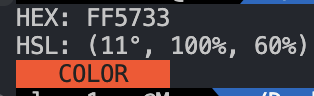

# hex-to-hsl-cli

**hex-to-hsl-cli** is a CLI tool that converts hex to hsl.


## Quick Start

Get **hex-to-hsl-cli** up and running quickly!

1. **Run**:
    ```bash
    npx hex-to-hsl-cli #ff5733
    ```
2. **Done!**

### Example Output

This will convert the HEX color `#ff5733` to its HSL equivalent, and display a color preview in your terminal.

- **Input**: `#ff5733`
- **Output**: `HSL: (12°, 100%, 50%)`
- **Color Preview**: `COLOR (in the specified color)`



## Contributing

We welcome contributions to **hex-to-hsl-cli**! Whether it's reporting a bug, suggesting an enhancement, or submitting a pull request, your input is valued.

## License

This project is licensed under the MIT License - see the [LICENSE](LICENSE) file for details.

## Contact

For any questions, suggestions, or feedback, please contact [love1ace](mailto:lovelacedud@gmail.com).